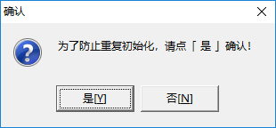
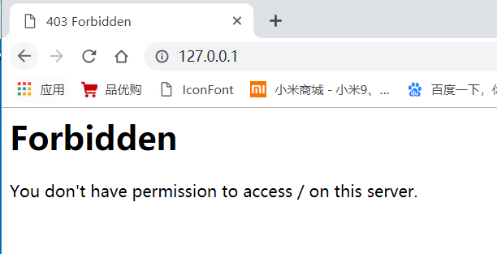
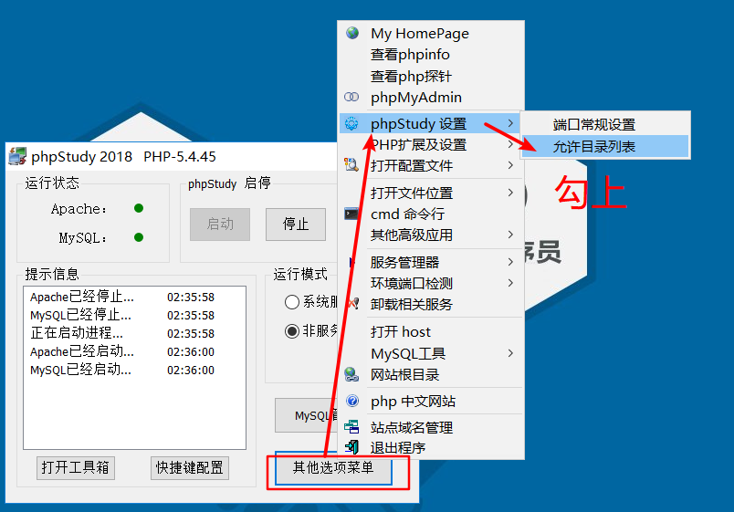

## 通过phpstudy把静态页面部署到web服务器

1. 安装phpstudy，注意不能有中文路径

   - 双击软件

   - 选择安装目录（注意，要求路径中不能有中文！！！默认的路径即可）

     

   - 点击ok之后，会默认跳转到phpstudy官网上，然后提示`为了防止重复初始化，选择是` 点击是即可！

     

   - 启动服务器

     

   - 然后可以访问自己本地的服务器，在地址栏中输入`127.0.0.1` 访问

2. 把自己的网页放到www文件夹中，找到安装目录下面的www文件夹，把www原有的文件删除, 把自己写好的页面放到这个文件夹中去

   

   

3. 默认会发现访问时, 会被拒绝

   

   

4. 设置允许目录访问

   

5. 通过查看自己的ip，通过浏览器输入ip地址访问自己写的网页

   >  通过飞秋可以查看IP
   >
   > win+r 输入cmd，往黑窗口中输入ipconfig，回车，以太网适配器查看192.168开头
